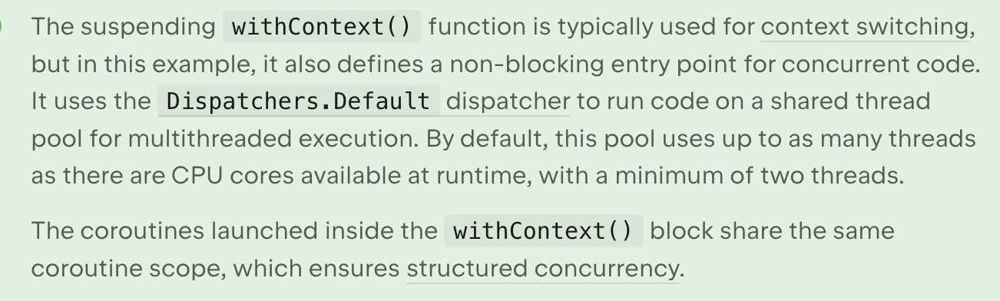

### Coroutine withContext


### Coroutine scope and structured concurrency
- When you run many coroutines in an application, you need a way to manage them as groups. Kotlin coroutines rely on a principle called structured concurrency to provide this structure.

- According to this principle, coroutines form a tree hierarchy of parent and child tasks with linked lifecycles. A coroutine's lifecycle is the sequence of states from its creation until completion, failure, or cancellation.

- A parent coroutine waits for its children to complete before it finishes. If the parent coroutine fails or gets canceled, all its child coroutines are recursively canceled too. Keeping coroutines connected this way makes cancellation and error handling predictable and safe.

- To maintain structured concurrency, new coroutines can only be launched in a CoroutineScope that defines and manages their lifecycle. The CoroutineScope includes the coroutine context, which defines the dispatcher and other execution properties. When you start a coroutine inside another coroutine, it automatically becomes a child of its parent scope.

### CorutineScope definition

```
interface CoroutineScope {
    val coroutineContext: CoroutineContext
}
```

### Coroutine Scope
The coroutineScope() function takes a lambda with a CoroutineScope receiver. Inside this lambda, the implicit receiver is a CoroutineScope, so builder functions like CoroutineScope.launch() and CoroutineScope.async() resolve as extension functions on that receiver.

```
public suspend fun <R> coroutineScope(block: suspend CoroutineScope.() -> R): R
```

### Coroutine Builder Functions

## Launch

- The CoroutineScope.launch() coroutine builder function is an extension function on CoroutineScope. It starts a new coroutine without blocking the rest of the scope, inside an existing coroutine scope.

## Async

- The CoroutineScope.async() coroutine builder function is an extension function on CoroutineScope. It starts a concurrent computation inside an existing coroutine scope and returns a Deferred handle that represents an eventual result. Use the .await() function to suspend the code until the result is ready: