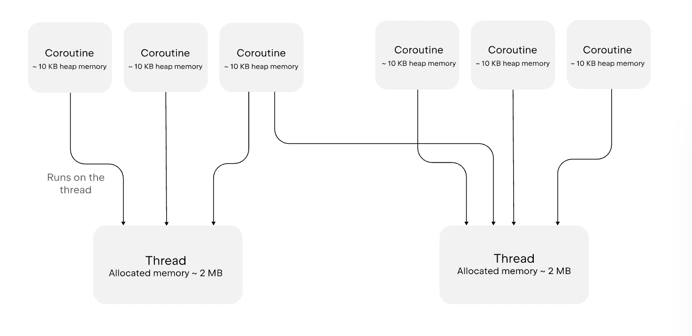

### Coroutine withContext


### Coroutine scope and structured concurrency
- When you run many coroutines in an application, you need a way to manage them as groups. Kotlin coroutines rely on a principle called structured concurrency to provide this structure.

- According to this principle, coroutines form a tree hierarchy of parent and child tasks with linked lifecycles. A coroutine's lifecycle is the sequence of states from its creation until completion, failure, or cancellation.

- A parent coroutine waits for its children to complete before it finishes. If the parent coroutine fails or gets canceled, all its child coroutines are recursively canceled too. Keeping coroutines connected this way makes cancellation and error handling predictable and safe.

- To maintain structured concurrency, new coroutines can only be launched in a CoroutineScope that defines and manages their lifecycle. The CoroutineScope includes the coroutine context, which defines the dispatcher and other execution properties. When you start a coroutine inside another coroutine, it automatically becomes a child of its parent scope.

### CorutineScope definition

```
interface CoroutineScope {
    val coroutineContext: CoroutineContext
}
```

### Coroutine Scope
The coroutineScope() function takes a lambda with a CoroutineScope receiver. Inside this lambda, the implicit receiver is a CoroutineScope, so builder functions like CoroutineScope.launch() and CoroutineScope.async() resolve as extension functions on that receiver.

```
public suspend fun <R> coroutineScope(block: suspend CoroutineScope.() -> R): R
```

### Coroutine Builder Functions

## Launch

- The CoroutineScope.launch() coroutine builder function is an extension function on CoroutineScope. It starts a new coroutine without blocking the rest of the scope, inside an existing coroutine scope.

## Async

- The CoroutineScope.async() coroutine builder function is an extension function on CoroutineScope. It starts a concurrent computation inside an existing coroutine scope and returns a Deferred handle that represents an eventual result. Use the .await() function to suspend the code until the result is ready:

## runBlocking
- The runBlocking() coroutine builder function creates a coroutine scope and blocks the current thread until the coroutines launched in that scope finish.

- Use runBlocking() only when there is no other option to call suspending code from non-suspending code:

```
import kotlin.time.Duration.Companion.milliseconds
import kotlinx.coroutines.*

// A third-party interface you can't change
interface Repository {
    fun readItem(): Int
}

object MyRepository : Repository {
    override fun readItem(): Int {
        // Bridges to a suspending function
        return runBlocking {
            myReadItem()
        }
    }
}

suspend fun myReadItem(): Int {
    delay(100.milliseconds)
    return 4
}
```

## Dispatchers

- A coroutine dispatcher controls which thread or thread pool coroutines use for their execution. Coroutines aren't always tied to a single thread. They can pause on one thread and resume on another, depending on the dispatcher. This lets you run many coroutines at the same time without allocating a separate thread for every coroutine.

```
suspend fun runWithDispatcher() = coroutineScope { // this: CoroutineScope
    this.launch(Dispatchers.Default) {
        println("Running on ${Thread.currentThread().name}")
    }
}
```

## Coroutines vs JVM Threads

A thread is managed by the operating system. Threads can run tasks in parallel on multiple CPU cores and represent a standard approach to concurrency on the JVM. When you create a thread, the operating system allocates memory for its stack and uses the kernel to switch between threads. This makes threads powerful but also resource-intensive. Each thread usually needs a few megabytes of memory, and typically the JVM can only handle a few thousand threads at once.

On the other hand, a coroutine isn't bound to a specific thread. It can suspend on one thread and resume on another, so many coroutines can share the same thread pool. When a coroutine suspends, the thread isn't blocked and remains free to run other tasks. This makes coroutines much lighter than threads and allows running millions of them in one process without exhausting system resources.



## Join

- join() suspends the current coroutine until the target job finishes.


